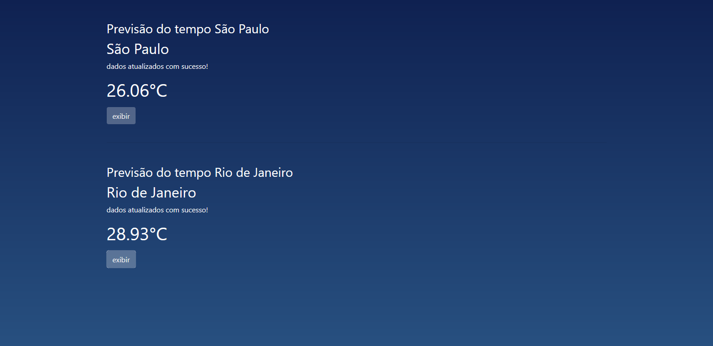
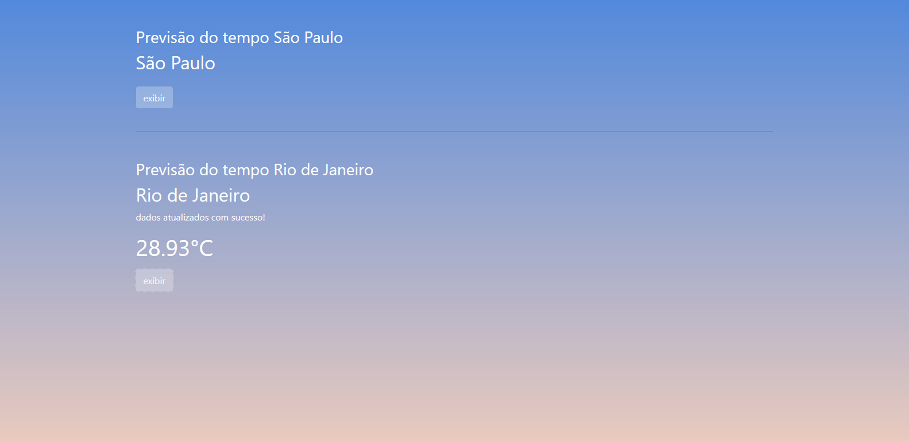

# Previsão do Tempo

Este é um site simples para visualização da previsão do tempo, consumindo uma API de clima. A aplicação foi desenvolvida utilizando API do openweathermap, HTML, CSS, JavaScript e Bootstrap, proporcionando uma interface intuitiva e responsiva.

## Tecnologias Utilizadas:
- **API REST Full**
- **JavaScript**
- **HTML**
- **CSS**
- **Bootstrap**
